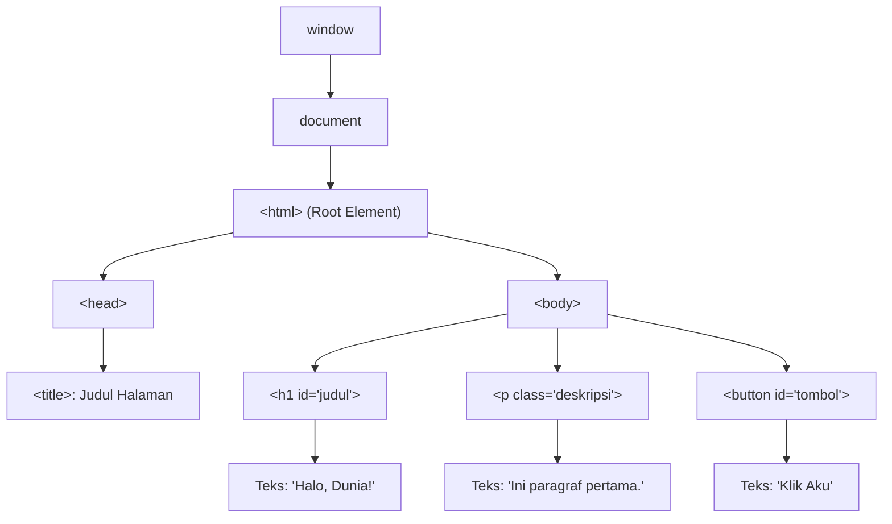

# 🌐 DOM (Document Object Model) dalam JavaScript

**DOM (Document Object Model)** adalah antarmuka pemrograman (*programming interface*) yang merepresentasikan dokumen HTML sebagai struktur pohon objek (*tree structure*). Melalui DOM, JavaScript memiliki kemampuan untuk membaca, memanipulasi struktur, mengubah isi teks, mengatur gaya CSS, hingga merespons interaksi pengguna secara dinamis dan *real-time*.

---

## 📌 Ringkasan Konsep DOM

| Konsep | Sintaks Utama | Keterangan |
|---|---|---|
| **Memilih Elemen** | `querySelector()`, `getElementById()` | Menemukan dan mengambil referensi elemen HTML |
| **Mengubah Konten** | `.textContent`, `.innerHTML` | Memperbarui teks atau markup HTML di dalam elemen |
| **Mengubah Tampilan** | `.classList.add()`, `.classList.toggle()`, `.style` | Mengatur styling CSS dan kelas dinamis |
| **Event Handling** | `addEventListener("click", fn)` | Mendengarkan dan merespons tindakan user (klik, ketik, submit) |
| **Membuat Elemen** | `createElement()`, `.append()`, `.remove()` | Menambah atau menghapus elemen dari halaman web |
| **Form Handling** | `input.value`, `e.preventDefault()` | Membaca input data formulir dan mencegah reload |

---

## 1. Analogi Sederhana: Memahami Hubungan HTML, CSS, DOM, & JS

Untuk mempermudah pemahaman siswa, bayangkan pembuatan sebuah **rumah**:

- 🧱 **HTML = Kerangka Bangunan**: Menentukan apa saja yang ada (dinding, pintu, jendela, sakelar).
- 🎨 **CSS = Desain & Cat Interior**: Menentukan warna dinding, ukuran jendela, dan keindahan tampilan.
- 🌳 **DOM = Cetak Biru Interaktif di Memori Browser**: Begitu browser membuka HTML, browser membuat model pohon objek dari seluruh bagian rumah agar dapat dikontrol oleh sistem.
- ⚡ **JavaScript = Penghuni / Pengendali Rumah**: Orang yang bisa menyalakan lampu saat sakelar diklik, mengecat ulang dinding, mengganti pintu baru, atau memindahkan perabot.

> **💡 Kalimat Kunci untuk Murid:**  
> *"DOM adalah cara browser menerjemahkan dokumen HTML menjadi sekumpulan objek hidup agar JavaScript bisa membaca dan mengubahnya."*

---

## 2. Struktur Pohon DOM (DOM Tree)

Ketika browser memuat halaman HTML, browser membentuk hierarki hierarkis yang disebut **DOM Tree**. Setiap elemen, atribut, dan teks di dalam HTML disebut sebagai **Node**.



### Jenis-Jenis Node Utama:
1. **Document Node**: Titik awal (*root*) untuk mengakses seluruh DOM (`document`).
2. **Element Node**: Tag HTML seperti `<h1>`, `<p>`, `<div>`, `<button>`.
3. **Text Node**: Teks yang berada di dalam elemen HTML.
4. **Attribute Node**: Atribut yang menempel pada elemen, seperti `id="judul"`, `class="btn"`, atau `href="/"`.

---

## 3. Cara Menghubungkan JavaScript ke HTML

Tempatkan file JavaScript menggunakan tag `<script>` tepat sebelum penutup tag `</body>` atau gunakan atribut `defer` pada tag `<head>` agar elemen HTML selesai dimuat terlebih dahulu sebelum JavaScript dijalankan:

```html
<!-- Opsi 1: Menggunakan defer di tag head (Direkomendasikan) -->
<head>
  <script src="script.js" defer></script>
</head>

<!-- Opsi 2: Sebelum tag penutup body -->
<body>
  <h1 id="judul">Halo, Dunia!</h1>
  <script src="script.js"></script>
</body>
```

---

## 4. Memilih Elemen DOM (Selecting Elements)

Sebelum bisa memanipulasi elemen, kita harus memilih elemen tersebut terlebih dahulu.

```html
<h1 id="judul-utama">Selamat Datang</h1>
<p class="paragraf">Paragraf 1</p>
<p class="paragraf">Paragraf 2</p>
<button class="btn-aksi">Tombol Aksi</button>
```

```js
// 1. Berdasarkan ID (paling cepat & spesifik)
const judul = document.getElementById("judul-utama");

// 2. Berdasarkan CSS Selector (Fleksibel: ID, Class, Tag, Attribute)
const tombol = document.querySelector(".btn-aksi");    // Mengambil elemen pertama yang cocok
const judulQuery = document.querySelector("#judul-utama");

// 3. Mengambil BANYAK elemen sekaligus (NodeList)
const semuaParagraf = document.querySelectorAll(".paragraf");

// Kita bisa melakukan perulangan pada NodeList menggunakan .forEach()
semuaParagraf.forEach((paragraf, indeks) => {
  console.log(`Paragraf ke-${indeks + 1}:`, paragraf.textContent);
});
```

### Perbandingan Selector:

| Method | Return Value | Bisa `forEach` Langsung? | Contoh Penggunaan |
|---|---|---|---|
| `document.getElementById('id')` | 1 Element Node / `null` | Tidak | `#judul` |
| `document.querySelector('selector')` | 1 Element Node / `null` | Tidak | `.btn`, `#id`, `div > p` |
| `document.querySelectorAll('selector')` | `NodeList` | ✅ Ya | `.item`, `li.aktif` |
| `document.getElementsByClassName('class')` | `HTMLCollection` | ❌ Harus diubah ke array | `box` |

---

## 5. Mengubah Isi / Konten Elemen

Terdapat beberapa cara untuk mengubah teks maupun konten di dalam elemen:

```html
<div id="kotak">Halo, <strong>Kawan!</strong></div>
```

```js
const kotak = document.querySelector("#kotak");

// A. textContent — Mengambil/mengubah teks polos murni (Aman dan direkomendasikan)
console.log(kotak.textContent); // "Halo, Kawan!"
kotak.textContent = "Teks berhasil diperbarui!";

// B. innerHTML — Membaca atau merender tag HTML di dalamnya
// ⚠️ HATI-HATI: Jangan gunakan innerHTML dengan input langsung dari pengguna tanpa sanitasi (risiko XSS)
kotak.innerHTML = "Selamat <em>Datang</em> kembali!";
```

---

## 6. Mengubah Gaya (Styling) & Class

### A. Mengubah Style Langsung (`element.style`)
Properti CSS yang memiliki tanda hubung (*kebab-case*) diubah menjadi format *camelCase* di JavaScript:

```js
const judul = document.querySelector("#judul-utama");

judul.style.color = "#2563eb";           // CSS: color
judul.style.fontSize = "2rem";           // CSS: font-size
judul.style.backgroundColor = "#f1f5f9"; // CSS: background-color
judul.style.padding = "10px 16px";
judul.style.borderRadius = "8px";
```

### B. Menggunakan `classList` (Praktik Terbaik)
Memisahkan styling di file CSS dan hanya mengganti nama *class* menggunakan JavaScript:

```css
/* style.css */
.dark-mode {
  background-color: #1e293b;
  color: #f8fafc;
}

.tersembunyi {
  display: none;
}
```

```js
const kartu = document.querySelector(".card");

// Menambah class
kartu.classList.add("dark-mode");

// Menghapus class
kartu.classList.remove("tersembunyi");

// Toggle class (tambah jika belum ada, hapus jika sudah ada)
kartu.classList.toggle("aktif");

// Mengecek apakah elemen memiliki class tertentu (mengembalikan true / false)
if (kartu.classList.contains("dark-mode")) {
  console.log("Mode gelap sedang aktif");
}
```

---

## 7. Menangani Event (Event Handling)

Event adalah tindakan yang terjadi di halaman web, seperti klik mouse, ketikan keyboard, submit formulir, atau gerakan scroll.

### Sintaks Dasar `addEventListener`

```js
targetElemen.addEventListener("namaEvent", function(event) {
  // Kode yang akan dijalankan ketika event terjadi
});
```

### Daftar Event Populer:

| Event | Kapan Terjadi? |
|---|---|
| `click` | Saat elemen diklik oleh pengguna |
| `input` | Saat pengguna mengetik di `<input>` atau `<textarea>` secara langsung |
| `change` | Saat nilai elemen berubah (contoh: dropdown `<select>` dipilih) |
| `submit` | Saat formulir dikirimkan (*form submission*) |
| `keydown` / `keyup` | Saat tombol keyboard ditekan / dilepas |
| `mouseover` / `mouseout` | Saat kursor mouse masuk / keluar dari elemen |

### Contoh Event Klik & Objek Event:

```html
<button id="btn-klik">Klik Saya</button>
<a id="tautan" href="https://google.com">Kunjungi Google</a>
```

```js
const tombol = document.querySelector("#btn-klik");
const tautan = document.querySelector("#tautan");

// 1. Menangkap klik
tombol.addEventListener("click", (event) => {
  console.log("Tombol diklik!");
  console.log("Elemen target:", event.target);
});

// 2. Mencegah aksi bawaan browser dengan event.preventDefault()
tautan.addEventListener("click", (event) => {
  event.preventDefault(); // Mencegah browser berpindah halaman ke Google
  alert("Navigasi dicegah oleh JavaScript!");
});
```

---

## 8. Membuat & Menghapus Elemen (DOM Manipulation)

JavaScript memungkinkan kita membuat elemen baru dari nol dan menampilkannya di halaman web.

```html
<ul id="daftar-tugas">
  <li>Belajar HTML</li>
</ul>
<button id="btn-tambah">Tambah Tugas</button>
```

```js
const daftar = document.querySelector("#daftar-tugas");
const tombolTambah = document.querySelector("#btn-tambah");

tombolTambah.addEventListener("click", () => {
  // 1. Buat elemen baru dengan document.createElement()
  const itemBaru = document.createElement("li");

  // 2. Beri teks & class
  itemBaru.textContent = "Belajar Manipulasi DOM";
  itemBaru.classList.add("item-tugas");

  // 3. Masukkan ke dalam parent menggunakan .append() atau .appendChild()
  daftar.append(itemBaru);
});

// 4. Menghapus elemen
// itemBaru.remove(); // Menghapus elemen langsung
```

---

## 9. Form Handling (Membaca Nilai Input)

Membaca nilai dari formulir pengguna dan merespons tombol submit:

```html
<form id="form-pesan">
  <input type="text" id="input-nama" placeholder="Masukkan nama kamu" required />
  <button type="submit">Kirim</button>
</form>
<p id="hasil-sapaan"></p>
```

```js
const formPesan = document.querySelector("#form-pesan");
const inputNama = document.querySelector("#input-nama");
const hasilSapaan = document.querySelector("#hasil-sapaan");

formPesan.addEventListener("submit", (e) => {
  // Mencegah halaman reload otomatis saat form di-submit
  e.preventDefault();

  const nilaiInput = inputNama.value.trim();

  if (nilaiInput !== "") {
    hasilSapaan.textContent = `Halo, ${nilaiInput}! Selamat belajar DOM 🎉`;
    inputNama.value = ""; // Mengosongkan kembali input
  }
});
```

---

## 10. Proyek Mini Praktik: Counter Interaktif Lengkap

Berikut contoh lengkap kode satu file (*all-in-one*) yang siap disalin dan langsung dicoba oleh siswa di browser:

```html
<!DOCTYPE html>
<html lang="id">
<head>
  <meta charset="UTF-8" />
  <meta name="viewport" content="width=device-width, initial-scale=1.0" />
  <title>Latihan DOM — Counter Interaktif</title>
  <style>
    body {
      font-family: system-ui, -apple-system, sans-serif;
      display: flex;
      justify-content: center;
      align-items: center;
      min-height: 100vh;
      background-color: #f8fafc;
      margin: 0;
    }
    .card {
      background: white;
      padding: 2rem;
      border-radius: 12px;
      box-shadow: 0 4px 6px -1px rgba(0, 0, 0, 0.1);
      text-align: center;
      width: 300px;
    }
    .nilai-counter {
      font-size: 3.5rem;
      font-weight: bold;
      color: #0f172a;
      margin: 1rem 0;
      transition: color 0.2s ease;
    }
    .btn-group {
      display: flex;
      gap: 8px;
      justify-content: center;
    }
    button {
      padding: 8px 16px;
      font-size: 1rem;
      font-weight: 600;
      cursor: pointer;
      border: 1px solid #cbd5e1;
      border-radius: 6px;
      background-color: #f1f5f9;
      transition: all 0.2s;
    }
    button:hover {
      background-color: #e2e8f0;
    }
    .btn-tambah { background-color: #dcfce7; color: #166534; border-color: #86efac; }
    .btn-kurang { background-color: #fee2e2; color: #991b1b; border-color: #fca5a5; }
  </style>
</head>
<body>

  <div class="card">
    <h2>Aplikasi Counter</h2>
    <div id="angka" class="nilai-counter">0</div>
    <div class="btn-group">
      <button id="btn-kurang" class="btn-kurang">-1</button>
      <button id="btn-reset">Reset</button>
      <button id="btn-tambah" class="btn-tambah">+1</button>
    </div>
  </div>

  <script>
    // 1. Ambil elemen-elemen DOM
    const angkaTeks = document.querySelector("#angka");
    const btnKurang = document.querySelector("#btn-kurang");
    const btnReset = document.querySelector("#btn-reset");
    const btnTambah = document.querySelector("#btn-tambah");

    // 2. Inisialisasi State
    let total = 0;

    // 3. Fungsi pembantu untuk memperbarui tampilan DOM
    function perbaruiTampilan() {
      angkaTeks.textContent = total;

      // Ubah warna teks berdasarkan nilai
      if (total > 0) {
        angkaTeks.style.color = "#16a34a"; // Hijau
      } else if (total < 0) {
        angkaTeks.style.color = "#dc2626"; // Merah
      } else {
        angkaTeks.style.color = "#0f172a"; // Netral
      }
    }

    // 4. Tambahkan Event Listener
    btnTambah.addEventListener("click", () => {
      total += 1;
      perbaruiTampilan();
    });

    btnKurang.addEventListener("click", () => {
      total -= 1;
      perbaruiTampilan();
    });

    btnReset.addEventListener("click", () => {
      total = 0;
      perbaruiTampilan();
    });
  </script>
</body>
</html>
```

---

## 11. Urutan Rekomendasi Belajar untuk Siswa

Agar tidak kewalahan, ikuti urutan belajar DOM berikut secara bertahap:

1. **Memilih Elemen**: Kuasai `document.querySelector()` dan `document.querySelectorAll()`.
2. **Mengubah Konten**: Gunakan `.textContent` untuk teks dan `.innerHTML` jika butuh struktur tag.
3. **Mengubah Gaya & Tampilan**: Pahami manipulasi class dengan `.classList.toggle()` dan `.classList.add()`.
4. **Merespons Tindakan Pengguna**: Latihan event `"click"`, `"input"`, dan `"submit"` menggunakan `addEventListener()`.
5. **Membuat Elemen Baru**: Buat item dinamis dengan `document.createElement()` dan `.append()`.
6. **Studi Kasus Mini-Project**:
   - ✅ Counter Sederhana (Tambah / Kurang / Reset)
   - ✅ Toggle Mode Gelap / Terang (*Dark/Light Mode*)
   - ✅ To-Do List Mini (Tambah & Hapus tugas)
   - ✅ Validasi Formulir Pendaftaran

---

<p align="center">
  Dibuat dengan ❤️ untuk Ekskul Web Development
</p>
